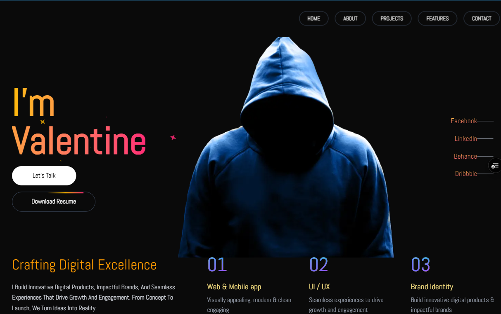

# Minimalistic - Portfolio Website

   

A modern portfolio website for product designer **John Doe**, featuring smooth animations and CMS-powered content. Built with cutting-edge technologies to showcase professional projects and availability status.



## ✨ Features
- **Dynamic "Available for Work" Banner**  
  Prominent status indicator with animated transitions.
- **Project Showcase**  
  - Expense Tracker: Firebase-powered financial management tool
  - Cinemaz: Centralized movie platform
  - Shopping Cart: Streamlined e-commerce system
  - Ride: (Upcoming project)
- **Interactive UI**  
  - Smooth page transitions & hover animations
  - Contact options with email copy functionality
  - Responsive design across all devices
- **CMS Integration**  
  Easily update content through Sanity Studio

## 🛠 Technologies
- **Framework**: Next.js 15.2.x (App Router)
- **CMS**: Sanity.io
- **Animations**: Framer Motion
- **Styling**: Tailwind CSS
- **Icons**: React Icons
- **Deployment**: Vercel (Recommended)

## 🚀 Installation
1. Clone repository:
   ```bash
   git clone https://github.com/devalentineomonya/Portfolio-Website-NextJS-TS-V2.git
   ```
2. Install dependencies:
   ```bash
   npm install
   ```
3. Set up environment variables:
   ```env
   NEXT_PUBLIC_SANITY_PROJECT_ID=your_project_id
   NEXT_PUBLIC_SANITY_DATASET=production
   ```

## 🔧 Sanity Configuration
1. Install Sanity CLI:
   ```bash
   npm install -g @sanity/cli
   ```
2. Navigate to Sanity folder:
   ```bash
   cd studio
   ```
3. Start Sanity Studio:
   ```bash
   sanity start
   ```
4. Configure your content schemas in `studio/schemas`

## 🖥 Running the App
```bash
npm run dev
```

## 🤝 Contributing
1. Fork the project
2. Create your feature branch (`git checkout -b feature/AmazingFeature`)
3. Commit changes (`git commit -m 'Add some AmazingFeature'`)
4. Push to branch (`git push origin feature/AmazingFeature`)
5. Open a Pull Request

## 📄 License
Distributed under the MIT License. See `LICENSE` for more information.

## 📧 Contact
John Doe - [valomosh254@gmail.com](mailto:valomosh254@gmail.com)  
Project Link: [https://github.com/devalentineomonya/Portfolio-Website-NextJS-TS-V2](https://github.com/devalentineomonya/Portfolio-Website-NextJS-TS-V2)
